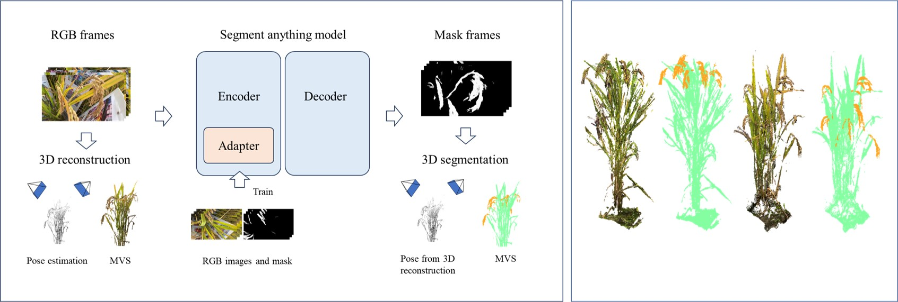
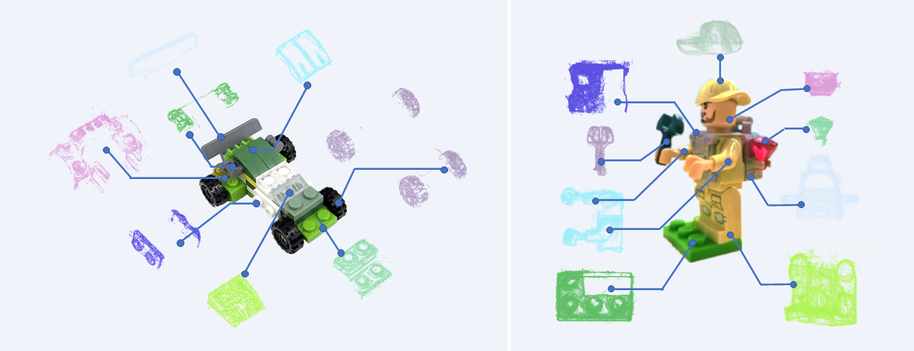

# OSTRA

**OSTRA** is an One Stop 3D multi-target reconstruction and segmentation framework. It takes the multview images (or videos) and segmentation of targets in each image as the input, generates targets’ 3D models embedded with rich multi-scale segmentation information. 
      We also provide a pipeline to segment objects consistently. Users can choose the Segment-Anything Model (SAM) or the video object segmentation (VOS) approach. SAM can generate good segmentation most of time, but for challenging tasks such as plant panicle segmentation, we suggeste to use a trained SAM-Adapter. 


**VOS**: We use the methods from Yang and Cheng as the foundation for VOS. The VOS approach enables the generation of continuous masks across video frames. Users can select suitable VOS models tailored to their specific tasks.

**You can check detailed tutorials [here](./VOS/doc/tutorials.md)!**

**SAM-Adapter** We use Tianrun Chen's work as the backbone for SAM-Adapter.  The adapter here can improve SAM's segmentation performance on rice panicles by fine-tuning it with downstream training. Users can train their own adapter for specific objects.

**You can check detailed tutorials [here](https://github.com/tianrun-chen/SAM-Adapter-PyTorch)!**

## :computer:Getting Started
### Clone OSTRA
This project is tested under python3.9, cuda11.5 and pytorch1.11.0. An equivalent or higher version is recommended.
```shell
#Clone OSTRA
git clone --recursive https://github.com/ganlab/OSTRA.git
cd OSTRA

#Install dependencies:
pip install -r requirements.txt
```

### Install Colmap
Our reconstruction process is based on Colmap. Please follow the instruction and install [Colmap](https://github.com/colmap/colmap) first.

### Target reconstruction
Colmap pipeline
```shell
python reconstruction_Colmap.py
```

Colmap + OpenMVS pipline
```shell
python reconstruction_OpenMVS.py
```

## :film_projector: Demo

Two samples of complex object segmentation:
<div align=center class='img_top'>

</div>

<div align=center class='img_top'>

</div>

<div align=center class='img_top'>

</div>

## :book:Citation
Please considering cite our paper if you find this work useful!
```
@article{Xu2026,
  author    = {Xu, Jiexiong and Lee, Jiyoung and Gan, Xiangchao},
  title     = {High-density field-based 3D reconstruction of rice architecture across diverse cultivars for genome-wide association studies},
  journal   = {Plant Methods},
  volume    = {22},
  number    = {1},
  pages     = {21},
  year      = {2026},
  doi       = {10.1186/s13007-026-01499-5},
  url       = {https://doi.org/10.1186/s13007-026-01499-5}
}

```

## License
Free for non-profit research purposes. Please contact authors otherwise. The program itself may not be modified in any way and no redistribution is allowed.
No condition is made or to be implied, nor is any warranty given or to be implied, as to the accuracy of OSTRA, or that it will be suitable for any particular purpose or for use under any specific conditions, or that the content or use of OSTRA will not constitute or result in infringement of third-party rights.

## :clap: Acknowledgements
This work is based on [Segment Anything](https://github.com/facebookresearch/segment-anything),  [Track Anything](https://github.com/gaomingqi/Track-Anything/tree/master), [Segment and Track Anything](https://github.com/z-x-yang/Segment-and-Track-Anything), [Colmap](https://github.com/colmap/colmap), [Open3D](https://github.com/isl-org/Open3D) and [SAM-Adapter-backbone](https://github.com/tianrun-chen/SAM-Adapter-PyTorch). The software is developed by following author(s) and supervised by Prof. Xiangchao Gan(gan@njau.edu.cn)

Authors:

Jiexiong Xu 
xujx@stu.njau.edu.cn 
work: framework and reconstruction module

Weikun Zhao 
zhaowk@stu.njau.edu.cn 
work: VOS module
