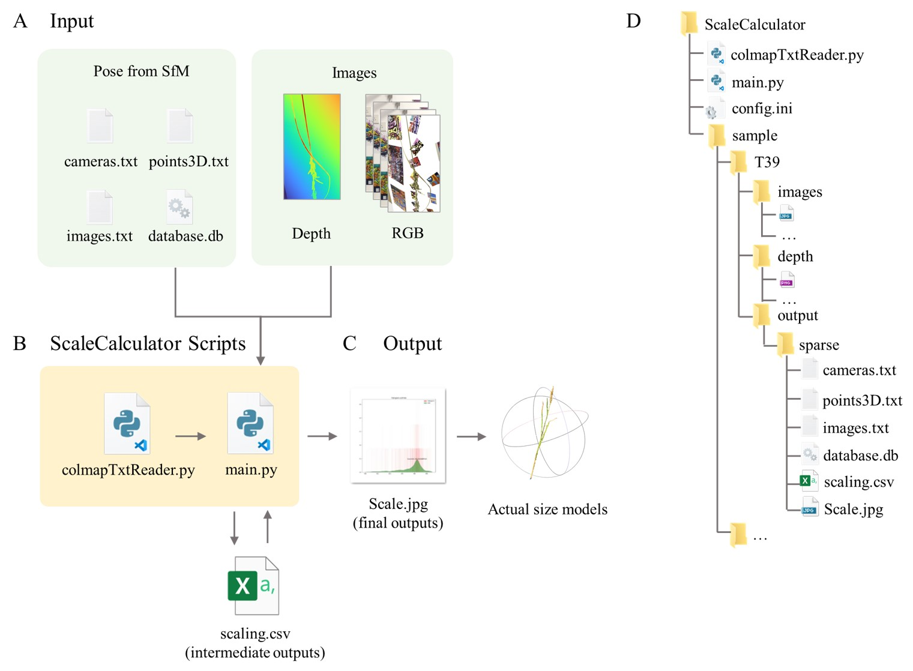

# ScaleCalculator
<div align=center class='img_top'>

</div>
The ScaleCalculator can adjust the relative scale of 3D models reconstructed during the process by integrating depth images, transforming them into actual-size 3D models.

You can run the script to perform depth-based scale estimation. 
```shell
python ScaleCalculator/main.py 
```
We have provided a sample for you to test in ScaleCalculator/sample.

## :book:Citation
Please considering cite our paper if you find this work useful!
```
@misc{
}
```

## License
Free for non-profit research purposes. Please contact authors otherwise. The program itself may not be modified in any way and no redistribution is allowed.
No condition is made or to be implied, nor is any warranty given or to be implied, as to the accuracy of ScaleCalculator, or that it will be suitable for any particular purpose or for use under any specific conditions, or that the content or use of ScaleCalculator will not constitute or result in infringement of third-party rights.

## :clap: Acknowledgements
The software is developed by following author(s) and supervised by Prof. Xiangchao Gan(gan@njau.edu.cn)

Author:

Jiexiong Xu
xujx@stu.njau.edu.cn
work: The development and testing of the ScaleCalculator.
