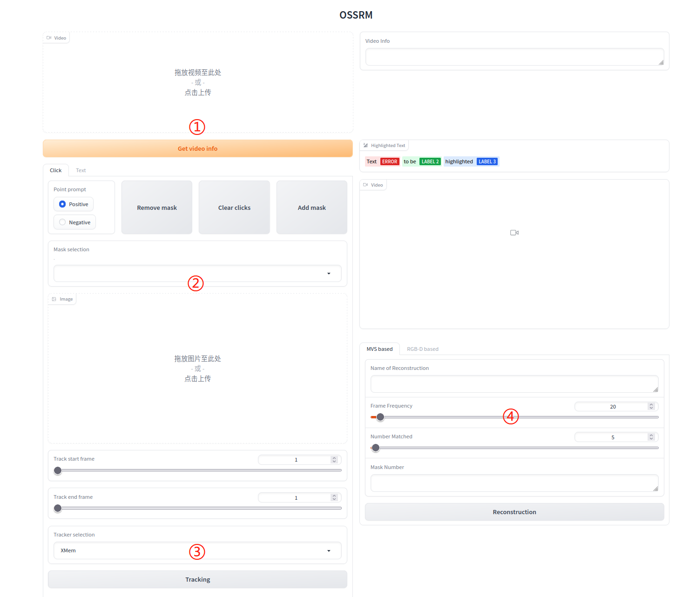
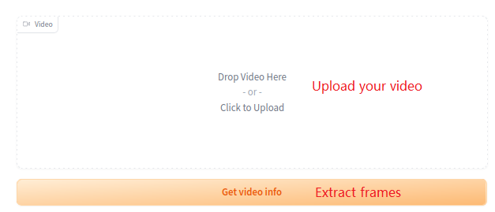
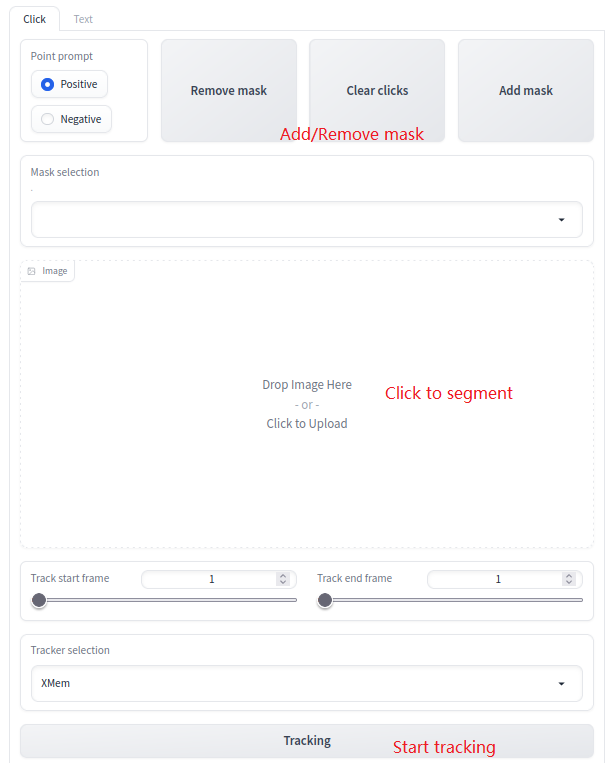
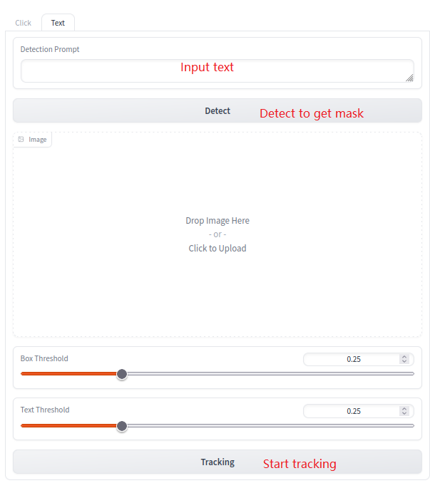
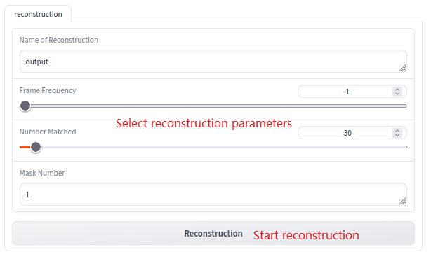
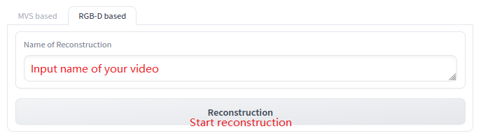

## Welcome to OSSRM Tutorials

This is a brief instruction of OSSRM where you can find the whole pipeline including [extracting frames](#step1), [segmentation](#step2), [tracking](#step3) and [reconstruction](#step4).

When you first launch OSSRM, the panel may look like:
<div align=center class="img_main">

</div>


### <span id="step1">1. Extracting Frames</span>

<div align=center class='img_extract'>

</div>

**1-1.** Select the video input area to input the video that you want to segment.

**1-2.** Click "Get video info" button to get the first frame and all rgb frames of the video. Then the first frame will display in the image area below.


### <span id="step2">2. Segmentation</span>

#### 2.1 Segment by clicks

<div align=center class='img_click'>

</div>

**2.1-1.** If you want to segment the first frame by clicks, please choose the "Click" tab.

**2.1-2.** Choose "Track start frame" and "Track end frame" to determine the range you want to segment. Usually the default value is the first frame and the last frame.

**2.1-3.** Click on the object you want to segment in the picture, then click the "Add mask" button when you finish choosing. If you want to segment multiple objects, you can continue to add mask.

**2.1-4.** If the mask covers areas that you don't want to choose, you can use the "Negative" point to deselect. You can also use the "Clear clicks" button to clear all your clicks.

**2.1-5.** When the mask you select is correct, you can continue to the next step.

#### 2.2 Segment by text

<div align=center class='img_text'>

</div>

**2.2-1.** You can also segment with words you input. Please click the "Text" tab and wait for the initialization.

**2.2-2.** Input text to select objects you want to segment and click the "Detect" button to get the segmentation result.

### <span id="step3">3. Tracking</span>

**3-1.** After segmentation, you can then click the "Tracking" button.The results will be generated in ```result/{your video nane}/```.

**3-2.** Tracking section may take some time. If you find the results not good, you can go back to step [2.1-2](#step2):
- set the bad frames as "Track start frame"
- remove all masks
- choose the mask you want to segment again
- click the "Tracking" button

### <span id="step4">4. Reconstruction</span>


#### 4.1 MVS based reconstruction

<div align=center class='img_reconstruction_mvs'>

</div>

**4.1-1** The default value of "Name of Reconstruction" box will be set to the name of your video.

**4.1-2** "Frame Frequency" is the frequency of reconstruction images OSSRM used. For example, 1 means using every picture to reconstruction.

**4.1-3** “Number matched” will affect the quality of reconstruction. Higher value will lead to a higher cloud point quality, but also longer reconstruction time.

**4.1-4** Mask number is the number of mask you choose in previous steps. OSSRM will generate different cloud point file according to the mask number.

**4.1-5** After setting these parameters, click "Reconstruction" button to start.

**4.1-6** The cloud point file will be generated in ```reconstruction/{your_video_name}/ply_file```

#### 4.2 RGB-D based reconstruction

<div align=center class='img_reconstruction_mvs'>

</div>

**4.2-1** First, you need to upload the configuration file and depth images required for reconstruction. The name of configuration file should be the same as your video name. Please put these files in ```result/``` and the directory will be like:
```
--result
    --{your video name}
        --depth
        --images
        --images-mask
        --{your video name}.json
```

**4.2-2** Input the name of your video in "Name of Reconstruction" textbox.

**4.2-3** Click "Reconstruction" button to start RGB-D reconstruction.

**4.2-4** The mesh file will be generated in ```reconstruction/{your video name}/scene```.